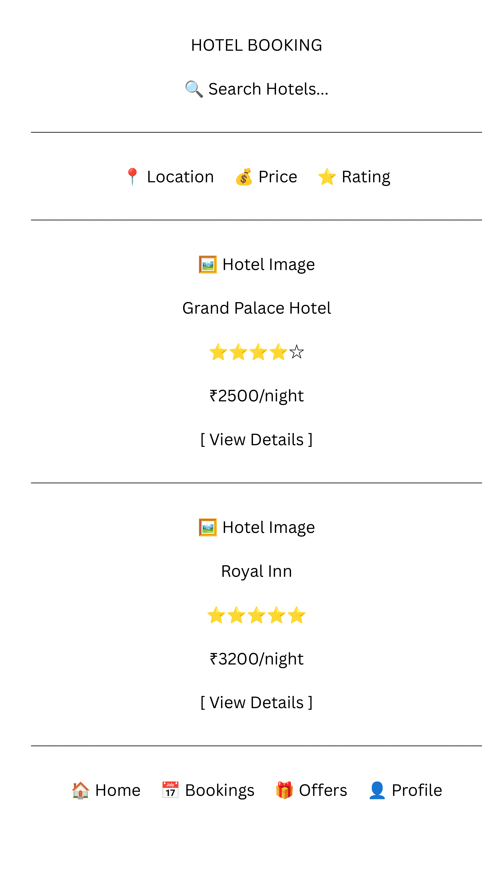
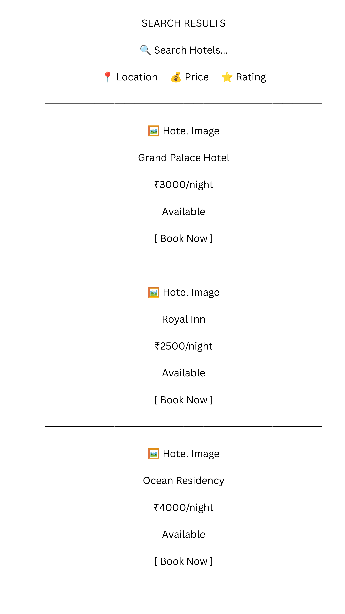
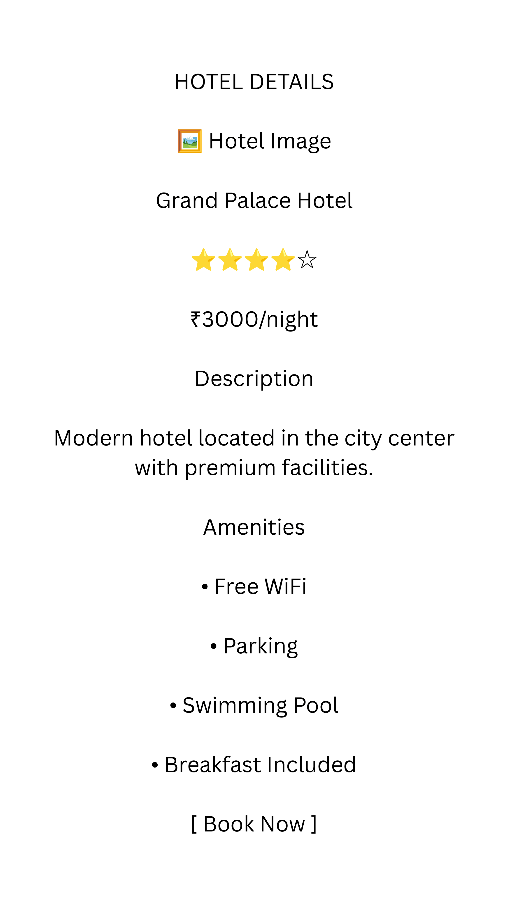
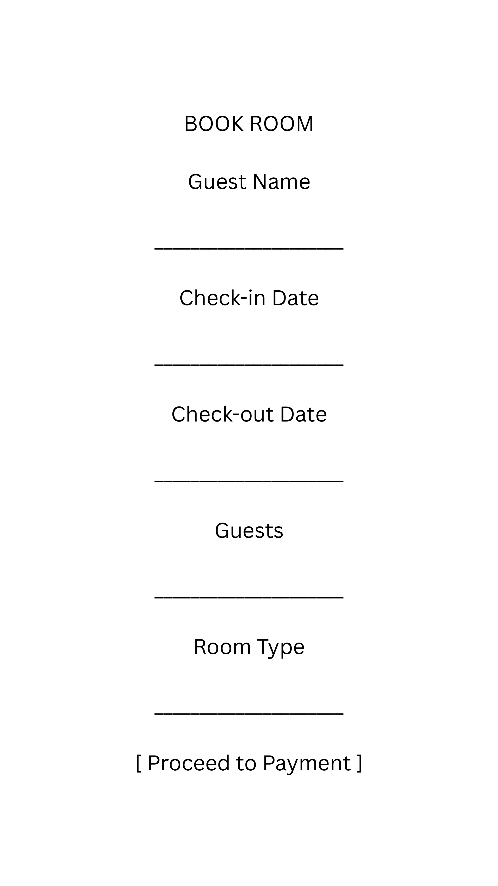
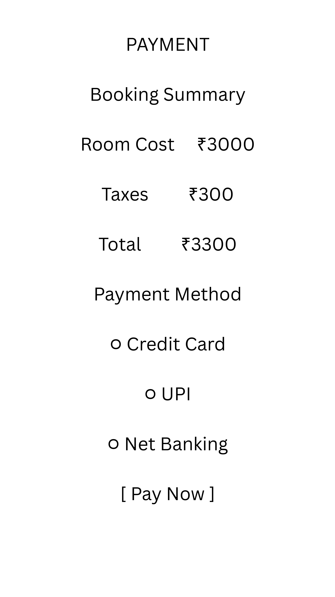
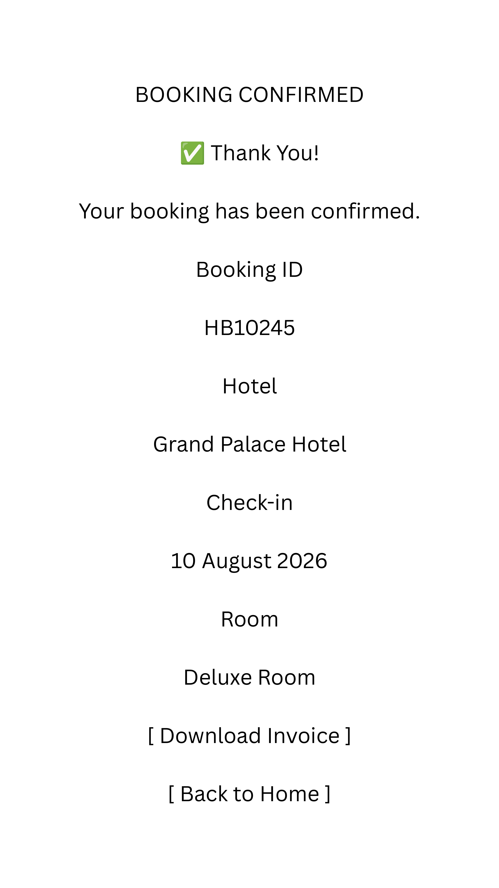

# Hotel Booking Product Case Study

## Overview

This case study explores the design of a hotel booking platform that improves the booking experience for travelers while helping hotels manage reservations efficiently.

The project focuses on product discovery, requirement gathering, user research, competitor analysis, feature prioritization, and UX wireframing.

---

## Problem Statement

Many travelers struggle to book hotel rooms quickly because of:

- Confusing booking process
- Hidden prices
- Slow check-in experience
- Limited payment options
- Poor visibility of room availability

Hotels also face challenges in managing reservations, guest communication, and improving customer experience.

The goal is to build a hotel booking platform that simplifies reservations and provides a seamless experience for both guests and hotels.

---

## Goals

- Create a simple and user-friendly hotel booking experience
- Reduce booking time for customers
- Improve hotel reservation management
- Enable digital check-in and online payments
- Increase customer engagement through reviews and loyalty rewards

---

## Features

### Core Features

- User Registration and Login
- Search Hotels
- View Room Details
- Real-Time Room Availability
- Online Booking
- Booking Cancellation
- Online Payments
- Digital Check-in
- Guest Reviews and Ratings
- Loyalty Rewards
- Booking History
- Notifications

---

## User Personas

### Persona 1: Traveler

**Name:** Rahul Sharma

**Occupation:** Software Engineer

**Goals:**
- Quickly find available hotels
- Compare prices
- Complete booking easily

**Pain Points:**
- Hidden charges
- Slow booking process
- Long check-in queues

### Persona 2: Business Traveler

**Name:** Sneha Patel

**Occupation:** Business Professional

**Goals:**
- Fast check-in
- Digital invoices
- Reliable hotel services

**Pain Points:**
- Poor customer support
- Lack of loyalty benefits

---

## Competitor Analysis

| Feature | Booking.com | Airbnb | OYO | Our Product |
|---|---|---|---|---|
| Hotel Search | ✅ | ✅ | ✅ | ✅ |
| Online Booking | ✅ | ✅ | ✅ | ✅ |
| Online Payment | ✅ | ✅ | ✅ | ✅ |
| Digital Check-in | Limited | Limited | Limited | ✅ |
| Loyalty Rewards | Limited | ❌ | ✅ | ✅ |
| Guest Reviews | ✅ | ✅ | ✅ | ✅ |

### Opportunities

- Faster booking experience
- Digital check-in
- Better loyalty program
- Improved hotel management features

---

## User Stories

- As a traveler, I want to search hotels so that I can find suitable rooms.

- As a traveler, I want to filter hotels by price and rating so that I can choose the best option.

- As a guest, I want online payment so that I can complete my booking easily.

- As a guest, I want digital check-in so that I can avoid waiting at reception.

- As a hotel manager, I want booking notifications so that I can prepare rooms.

---

## Product Roadmap

### Phase 1 - MVP

- User Registration
- Hotel Search
- Room Availability
- Booking System
- Online Payment

### Phase 2 - Enhancement

- Digital Check-in
- Guest Reviews
- Notifications
- Booking History

### Phase 3 - Future Improvements

- AI Hotel Recommendations
- Loyalty Program
- Personalized Offers
- Analytics Dashboard

---

## Wireframes

### Home Page

### Search Results

### Hotel Details

### Booking Screen

### Payment Page

### Confirmation Page

---

## Product Requirement Document (PRD)

### Product Name

Hotel Booking Platform

### Objective

Create a seamless hotel booking experience for travelers while improving reservation management for hotels.

### Target Users

- Travelers
- Business Professionals
- Hotel Managers

### Functional Requirements

- User authentication
- Hotel search
- Room booking
- Online payments
- Digital check-in
- Reviews and ratings

### Success Metrics

- Booking completion rate
- Customer satisfaction score
- Average booking time
- Repeat customers

---

## Conclusion

This product case study demonstrates product management skills including user research, requirement gathering, competitor analysis, user story creation, roadmap planning, PRD documentation, and wireframing.